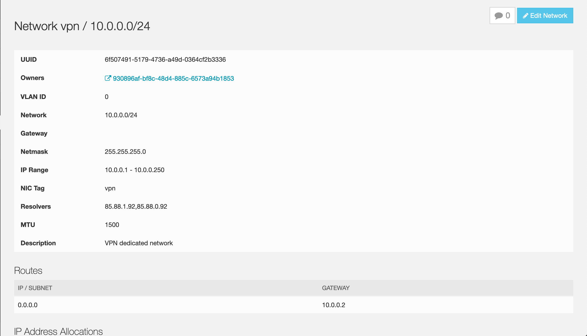

# illumos port of wireguard-go

[Useful link for learning how to use WireGuard](https://emanuelduss.ch/2018/09/wireguard-vpn-road-warrior-setup/)

## GREENBAUM Docs

#### Quick start
- Connect to the VPN instance

```
ssh root@85.88.23.16 -p 2020
```

- Start a `screen` session and start the WireGuard go server, then leave it open by disconnecting from the `screen` session

```
screen
/opt/src/wg-start.sh
```

- Disconnect from the `screen` session with `Ctrl + A`, then `D`. Workaround to leave the process running in the background.
- Run the setup script.

```
/opt/src/wg-setup.sh
```

- Verify everything is running fine

```
/opt/src/WireGuard-0.0.20190702/src/tools/wg
```

#### Overview
This is the wireguard config we use currently:

First, and this is triton specific, we need to create a dedicated `vpn` network. This allows us to let CNS generate DNS entries for instances on the `admin` network, e.g. `adminui0`. We use this with [triton-dehydrated](https://github.com/joyent/triton-dehydrated/) for Let's Encrypt SSL certs. Set  up a dedicated NIC, and set the nictags on the corresponding interfaces on each server. 

See this screenshot for an example vpn network config. Note that no default gateway is set, we use a **route** for NATing, so `adminui0` can check for new images on (images.joyent.com).

| Instance | IP on `vpn` network |
|:--------|:-------------------:|
| vpn        | 10.0.0.2          |
| adminui0   | 10.0.0.30         |



All the following setup is done in a SmartOS zone based on Joyent's SmartOS image `base-64-lts 18.4.0`.

View the WireGuard config `tun0.conf`, `ipnat.conf`, `wg-start.sh` start script and `wg-setup.sh` script to understand what's going on.

WireGuard server side. Peer's public keys need to match keys generated by peer's (client's) config.

`$ cat /opt/src/WireGuard-0.0.20190702/src/tools/tun0.conf`
```
[Interface]
   ListenPort = 51820
   PrivateKey = XXXX

[Peer]
   # client1 / MBP 2015 Jhonas
   PublicKey = hNvlmlGuLmVp2xSjLW4zLrO1riUTADif5GKunrDZ12I=
   AllowedIPs = 5.0.0.2/32, 10.0.0.0/24, 10.88.88.0/24

[Peer]
   # client2 / iPhone 6 Jhonas
   PublicKey = UIpr0665cvhR2BxsO8nQCwlcfETtHj3Jai1RVSaZjFg=
   AllowedIPs = 5.0.0.3/32, 10.0.0.0/24, 10.88.88.0/24

[Peer]
   # client3 / MBP 2018 Mike
   PublicKey = 8cGnCdYJZKXQ+o/cBZjRlyhYKTeoSzRebTgY1saBkF0=
   AllowedIPs = 5.0.0.4/32, 10.0.0.0/24, 10.88.88.0/24
```

WireGuard client side example.

```
# client3 / MBP 2018 Mike
[Interface]
PrivateKey = # Client's private key
Address = 5.0.0.4/24 # Client IP here, same as used in tun0.conf

[Peer]
PublicKey = l0DJLicCrcrixNP6zAWTXNSEaNM2jML253BXEZ1KpiU= # Server's public key
AllowedIPs = 5.0.0.0/24, 10.0.0.0/24, 10.88.88.0/24
Endpoint = 85.88.23.16:51820
```

`$ cat /etc/ipf/ipnat.conf`
```
# VPN mapping
map * from 5.0.0.0/24 to any -> 0.0.0.0/32

# NAT mapping
map net0 10.0.0.0/24 -> 0/32 portmap tcp/udp 1025:65535
map net0 10.0.0.0/24 -> 0/32
```


`$ cat /opt/src/wg-start.sh`
```
#!/opt/local/bin/bash
/opt/src/wireguard-go-illumos-wip/wireguard-go -f tun
```


`$ cat /opt/src/wg-setup.sh`
```
#!/opt/local/bin/bash
echo "resetting ipfilter"
svcadm clear ipfilter && svcadm enable ipfilter
echo "setting up interface tun0"
ifconfig tun0 5.0.0.16 5.0.0.1 netmask 255.255.255.255 mtu 1420 up
echo "adding route"
route add 5.0.0.0/24 5.0.0.1
echo "setting wireguard conf"
/opt/src/WireGuard-0.0.20190702/src/tools/wg setconf tun0 /opt/src/WireGuard-0.0.20190702/src/tools/tun0.conf
```

### Original readme

This is a work-in-progress port of the Go version of
[WireGuard](https://www.wireguard.com/).  Basic functionality has been verified
on a current SmartOS system, which includes by default the necessary [TUN/TAP
Driver](http://www.whiteboard.ne.jp/~admin2/tuntap/).

In addition to the `wireguard-go` program built from this repository, you will
need to build the `wg` tool from the upstream
[WireGuard.git](https://git.zx2c4.com/WireGuard/); e.g.,

```
$ git clone https://git.zx2c4.com/WireGuard
$ cd WireGuard/src/tools
$ make LDLIBS='-lnsl -lsocket'
  CC      /ws/wireguard/WireGuard/src/tools/wg.o
  CC      /ws/wireguard/WireGuard/src/tools/set.o
  CC      /ws/wireguard/WireGuard/src/tools/mnlg.o
  CC      /ws/wireguard/WireGuard/src/tools/pubkey.o
  CC      /ws/wireguard/WireGuard/src/tools/showconf.o
  CC      /ws/wireguard/WireGuard/src/tools/genkey.o
  CC      /ws/wireguard/WireGuard/src/tools/setconf.o
  CC      /ws/wireguard/WireGuard/src/tools/curve25519.o
  CC      /ws/wireguard/WireGuard/src/tools/encoding.o
  CC      /ws/wireguard/WireGuard/src/tools/ipc.o
  CC      /ws/wireguard/WireGuard/src/tools/terminal.o
  CC      /ws/wireguard/WireGuard/src/tools/config.o
  CC      /ws/wireguard/WireGuard/src/tools/show.o
  LD      /ws/wireguard/WireGuard/src/tools/wg
$ ./wg
interface: tun0
```

At present, this port of `wireguard-go` must be run in the foreground (i.e.,
using `-f`) and only accepts the interface name `tun`.  A dynamic `tun[0-9]+`
device will be created for the duration of the process.

```
# ./wireguard-go -f tun
WARNING WARNING WARNING WARNING WARNING WARNING WARNING
W                                                     G
W   This is alpha software. It will very likely not   G
W   do what it is supposed to do, and things may go   G
W   horribly wrong. You have been warned. Proceed     G
W   at your own risk.                                 G
W                                                     G
WARNING WARNING WARNING WARNING WARNING WARNING WARNING
device tun0
ip_muxid 131
INFO: (tun0) 2019/03/26 08:26:38 Starting wireguard-go version 0.0.20181222
INFO: (tun0) 2019/03/26 08:26:38 Interface set up
INFO: (tun0) 2019/03/26 08:26:38 Device started
INFO: (tun0) 2019/03/26 08:26:38 UAPI listener started
```

Once the daemon is running, you'll need to configure the IP address and any
routes on your `tun` interface.  Due to the way point-to-point links need to be
configured on illumos at the moment, you'll need to set aside a "destination"
address to represent the remote side of the tunnel.  In the example below I've
used `5.0.1.1` as the IP address of this system, and `5.0.1.2` as the fake
destination address.  You can use the same fake destination IP on all systems
but no system on the VPN can use it as its actual IP.

```
# ifconfig tun0 5.0.1.1 5.0.1.2 netmask 255.255.255.255 mtu 1300 up
# ifconfig tun0
tun0: flags=10010008d1<UP,POINTOPOINT,RUNNING,NOARP,MULTICAST,IPv4,FIXEDMTU> mtu 1300 index 34
  inet 5.0.1.1 --> 5.0.1.2 netmask ffffffff
  ether 80:1c:25:4e:24:fe

# route add 5.0.1.0/24 5.0.1.2

# wg setconf tun0 tun0.conf
# wg
interface: tun0
  public key: <....>
  private key: (hidden)
  listening port: 51820

peer: <....>
  endpoint: 10.0.0.1:51820
  allowed ips: 5.0.1.3/32
  latest handshake: 1 minute, 16 seconds ago
  transfer: 331.72 KiB received, 12.15 MiB sent
```

The rest of the README is from the upstream repository:

# Go Implementation of [WireGuard](https://www.wireguard.com/)

This is an implementation of WireGuard in Go.

## Usage

Most Linux kernel WireGuard users are used to adding an interface with `ip link add wg0 type wireguard`. With wireguard-go, instead simply run:

```
$ wireguard-go wg0
```

This will create an interface and fork into the background. To remove the interface, use the usual `ip link del wg0`, or if your system does not support removing interfaces directly, you may instead remove the control socket via `rm -f /var/run/wireguard/wg0.sock`, which will result in wireguard-go shutting down.

To run wireguard-go without forking to the background, pass `-f` or `--foreground`:

```
$ wireguard-go -f wg0
```

When an interface is running, you may use [`wg(8)`](https://git.zx2c4.com/wireguard-tools/about/src/man/wg.8) to configure it, as well as the usual `ip(8)` and `ifconfig(8)` commands.

To run with more logging you may set the environment variable `LOG_LEVEL=debug`.

## Platforms

### Linux

This will run on Linux; however **YOU SHOULD NOT RUN THIS ON LINUX**. Instead use the kernel module; see the [installation page](https://www.wireguard.com/install/) for instructions.

### macOS

This runs on macOS using the utun driver. It does not yet support sticky sockets, and won't support fwmarks because of Darwin limitations. Since the utun driver cannot have arbitrary interface names, you must either use `utun[0-9]+` for an explicit interface name or `utun` to have the kernel select one for you. If you choose `utun` as the interface name, and the environment variable `WG_TUN_NAME_FILE` is defined, then the actual name of the interface chosen by the kernel is written to the file specified by that variable.

### Windows

This runs on Windows, but you should instead use it from the more [fully featured Windows app](https://git.zx2c4.com/wireguard-windows/about/), which uses this as a module.

### FreeBSD

This will run on FreeBSD. It does not yet support sticky sockets. Fwmark is mapped to `SO_USER_COOKIE`.

### OpenBSD

This will run on OpenBSD. It does not yet support sticky sockets. Fwmark is mapped to `SO_RTABLE`. Since the tun driver cannot have arbitrary interface names, you must either use `tun[0-9]+` for an explicit interface name or `tun` to have the program select one for you. If you choose `tun` as the interface name, and the environment variable `WG_TUN_NAME_FILE` is defined, then the actual name of the interface chosen by the kernel is written to the file specified by that variable.

## Building

This requires an installation of [go](https://golang.org) ≥ 1.12.

```
$ git clone https://git.zx2c4.com/wireguard-go
$ cd wireguard-go
$ make
```

## License

    Copyright (C) 2017-2019 WireGuard LLC. All Rights Reserved.
    
    Permission is hereby granted, free of charge, to any person obtaining a copy of
    this software and associated documentation files (the "Software"), to deal in
    the Software without restriction, including without limitation the rights to
    use, copy, modify, merge, publish, distribute, sublicense, and/or sell copies
    of the Software, and to permit persons to whom the Software is furnished to do
    so, subject to the following conditions:
    
    The above copyright notice and this permission notice shall be included in all
    copies or substantial portions of the Software.
    
    THE SOFTWARE IS PROVIDED "AS IS", WITHOUT WARRANTY OF ANY KIND, EXPRESS OR
    IMPLIED, INCLUDING BUT NOT LIMITED TO THE WARRANTIES OF MERCHANTABILITY,
    FITNESS FOR A PARTICULAR PURPOSE AND NONINFRINGEMENT. IN NO EVENT SHALL THE
    AUTHORS OR COPYRIGHT HOLDERS BE LIABLE FOR ANY CLAIM, DAMAGES OR OTHER
    LIABILITY, WHETHER IN AN ACTION OF CONTRACT, TORT OR OTHERWISE, ARISING FROM,
    OUT OF OR IN CONNECTION WITH THE SOFTWARE OR THE USE OR OTHER DEALINGS IN THE
    SOFTWARE.
